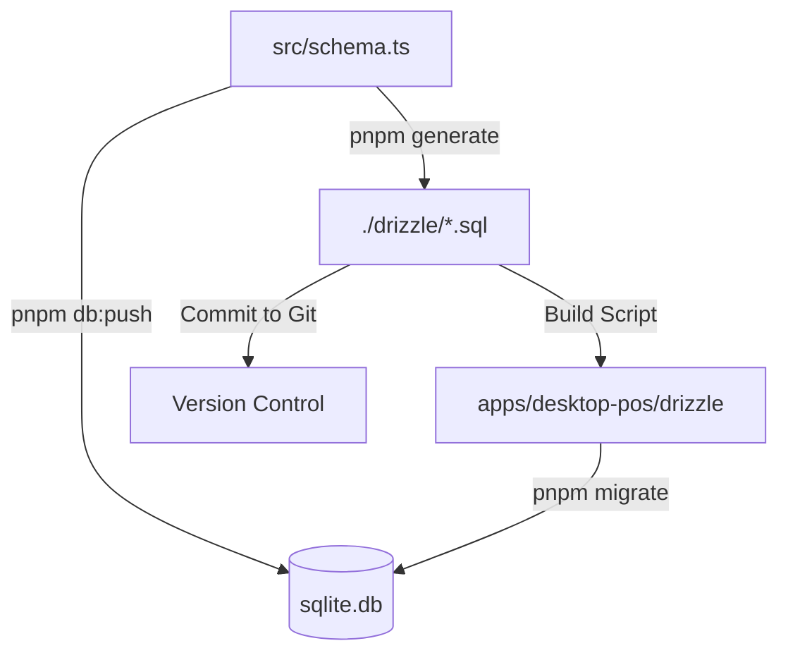

# 🗄️ @algo/db-local (SQLite + Drizzle)

> **The Single Source of Truth for the Desktop POS Database.**

This package manages the local SQLite database (`sqlite.db`) and its schema. It exports the database client (`db`) and schema objects for use in the Electron Desktop App.

---

## 🏗️ Architecture Overview

The database workflow is designed to balance **Development Speed** (Hot Reloading) with **Production Safety** (Migrations).



- **`src/schema.ts`**: You define your tables here (TypeScript).
- **`sqlite.db`**: The actual database file (Gitignored).
- **`./drizzle/`**: Folder containing SQL migration files (Version Controlled).

---

## 🚦 The Two Workflows (Crucial!)

### 🏎️ Workflow A: Rapid Prototyping (Daily Dev)

**Use this 90% of the time.**
You want to see changes immediately. You don't care about SQL history yet.

1. **Edit:** Modify `packages/db-local/src/schema.ts`.
2. **Sync:** Run the push command:

```bash
pnpm db:push --filter @algo/db-local

```

- ✅ **Effect:** Updates `sqlite.db` immediately.
- ❌ **Side Effect:** Does **NOT** create SQL files in `drizzle/`.

### 📦 Workflow B: Release Prep (Commit Time)

**Use this before merging to main.**
You are finalizing a feature and need to lock in the DB changes for production.

1. **Generate:** Create the SQL migration files:

```bash
pnpm generate --filter @algo/db-local

```

1. **Verify (Important):**

- _If you already ran `db:push` during dev:_ You are done. Your DB is up to date.
- _If you want to test the migration:_ Delete `sqlite.db` and run `pnpm migrate`.

1. **Commit:** `git add drizzle/`.

---

## 💻 Commands Reference

Run these from the root using `--filter @algo/db-local`.

| Command         | Description                                                   |
| --------------- | ------------------------------------------------------------- |
| `pnpm db:push`  | ⚡ **Sync Schema → DB.** No SQL files generated. Fast.        |
| `pnpm studio`   | 🕵️ **GUI.** Opens browser to view/edit table data.            |
| `pnpm generate` | 📝 **Create Migrations.** Generates `.sql` files for history. |
| `pnpm migrate`  | 🏗️ **Apply Migrations.** Runs `.sql` files against the DB.    |

---

## 🔌 Integration with Desktop POS

The Desktop App (`apps/desktop-pos`) consumes this package via two mechanisms:

### 1. The Code Link (`package.json`)

The app imports the DB client directly:

```json
"dependencies": {
  "@algo/db-local": "workspace:^"
}

```

### 2. The Asset Link (`scripts`)

When you run `pnpm dev` in the desktop app, it runs this "fail-safe" script:

```bash
shx rm -rf drizzle && shx mkdir -p drizzle && shx cp -r ../../packages/db-local/drizzle/* ./drizzle 2>/dev/null || true

```

- **What it does:** It tries to copy your SQL migrations to the app's folder.
- **Why `|| true`?** If you are using **Workflow A** (Prototyping), the source folder might be empty. We suppress the error so your build doesn't crash.

---

## 📝 Schema Guidelines

When editing `src/schema.ts`, follow these rules to ensure compatibility with our architecture.

### 1. Use UUIDs

We use client-side ID generation (safer for offline-first apps).

```typescript
id: text('id')
  .primaryKey()
  .$defaultFn(() => crypto.randomUUID());
```

### 2. Use Timestamps

Always track when data changes.

```typescript
createdAt: text('created_at').default(sql`(CURRENT_TIMESTAMP)`),
updatedAt: text('updated_at').$onUpdate(() => sql`(CURRENT_TIMESTAMP)`),

```

### 3. Define Relations

Drizzle requires explicit relation definitions for `.findMany({ with: ... })` to work.

```typescript
export const ordersRelations = relations(orders, ({ many }) => ({
  items: many(orderItems),
}));
```

---

## 🚨 Troubleshooting

### "Table 'xyz' already exists" during migrate

**Cause:** You mixed `db:push` and `migrate`. `db:push` created the table, so `migrate` tries to create it again and fails.
**Fix:** If you are switching to migrations, delete your local `sqlite.db` to start fresh.

### "The module was compiled against a different Node.js version"

**Context:** Electron uses a custom V8 engine version, while your terminal uses standard Node.js.
**Fix:** You must rebuild native dependencies (`better-sqlite3`) for Electron.

```bash
# Run in root
pnpm install
# OR
pnpm --filter @algo/desktop-pos exec electron-builder install-app-deps

```

### "Command not found: shx"

**Fix:** Install the utility in the desktop app.

```bash
pnpm add -D shx --filter @algo/desktop-pos

```

### "My new table isn't showing up in Drizzle Studio"

**Fix:** You likely forgot to push.

```bash
pnpm db:push --filter @algo/db-local

```
