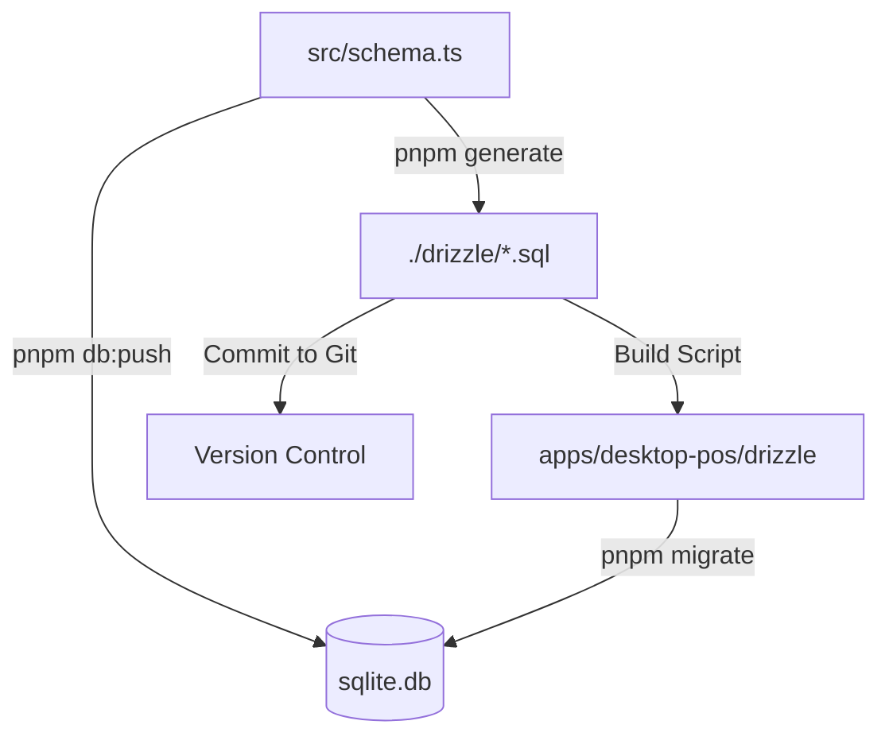

# 🗄️ @algo/db-local (SQLite + Drizzle)

> **The Single Source of Truth for the Desktop POS Database.**

This package manages the local SQLite database (`sqlite.db`) and its schema. It exports the database client (`db`) and schema objects for use in the Electron Desktop App.

## 📊 Database Schema

The database consists of **6 core tables**:

- **`categories`**: Product categorization
- **`products`**: Inventory and product master data
- **`orders`**: Transaction header records
- **`orderItems`**: Line items for each order
- **`customers`**: Customer information and loyalty points
- **`customerLedger`**: Customer credit/debt tracking (Pothe system)
- **`users`**: Cashier and admin user accounts

---

## 🏗️ Architecture Overview

The database workflow is designed to balance **Development Speed** (Hot Reloading) with **Production Safety** (Migrations).



- **`src/schema.ts`**: You define your tables here (TypeScript).
- **`sqlite.db`**: The actual database file (Gitignored).
- **`./drizzle/`**: Folder containing SQL migration files (Version Controlled).

---

## 🚦 The Two Workflows (Crucial!)

### 🏎️ Workflow A: Rapid Prototyping (Daily Dev)

**Use this 90% of the time.**
You want to see changes immediately. You don't care about SQL history yet.

1. **Edit:** Modify `packages/db-local/src/schema.ts`.
2. **Sync:** Run the push command:

```bash
pnpm db:push --filter @algo/db-local

```

- ✅ **Effect:** Updates `sqlite.db` immediately.
- ❌ **Side Effect:** Does **NOT** create SQL files in `drizzle/`.

### 📦 Workflow B: Release Prep (Commit Time)

**Use this before merging to main.**
You are finalizing a feature and need to lock in the DB changes for production.

1. **Generate:** Create the SQL migration files:

```bash
pnpm generate --filter @algo/db-local

```

1. **Verify (Important):**

- _If you already ran `db:push` during dev:_ You are done. Your DB is up to date.
- _If you want to test the migration:_ Delete `sqlite.db` and run `pnpm migrate`.

1. **Commit:** `git add drizzle/`.

---

## 💻 Commands Reference

Run these from the root using `--filter @algo/db-local`.

| Command         | Description                                                   |
| --------------- | ------------------------------------------------------------- |
| `pnpm db:push`  | ⚡ **Sync Schema → DB.** No SQL files generated. Fast.        |
| `pnpm studio`   | 🕵️ **GUI.** Opens browser to view/edit table data.            |
| `pnpm generate` | 📝 **Create Migrations.** Generates `.sql` files for history. |
| `pnpm migrate`  | 🏗️ **Apply Migrations.** Runs `.sql` files against the DB.    |

---

## 📦 Package Exports

This package exports the following for use in the Desktop POS app:

### Types

```typescript
import type { DB } from '@algo/db-local';
```

- **`DB`**: TypeScript type for the Drizzle database client instance
- **`schema`**: The complete schema object with all table definitions

### Functions

```typescript
import { initDb, runMigrations } from '@algo/db-local';
```

- **`initDb(dbPath: string)`**: Initializes the SQLite database with WAL mode and foreign keys enabled
- **`runMigrations(db, migrationsFolder)`**: Applies SQL migration files to the database

### Schema Tables

```typescript
import { products, orders, orderItems, customers } from '@algo/db-local';
```

All table definitions and relations are exported for direct use in queries.

### Database Configuration

The `initDb` function automatically:

- Creates the database directory if it doesn't exist
- Enables **WAL (Write-Ahead Logging)** mode for better concurrency
- Enables **Foreign Key constraints** (critical for SQLite!)
- Returns a fully configured Drizzle client with typed queries

---

## 🔌 Integration with Desktop POS

The Desktop App (`apps/desktop-pos`) consumes this package via two mechanisms:

### 1. The Code Link (`package.json`)

The app imports the DB client directly:

```json
"dependencies": {
  "@algo/db-local": "workspace:^"
}
```

### 2. The Asset Link (`scripts`)

When you run `pnpm dev` in the desktop app, it runs this "fail-safe" script:

```bash
shx rm -rf drizzle && shx mkdir -p drizzle && shx cp -r ../../packages/db-local/drizzle/* ./drizzle 2>/dev/null || true

```

- **What it does:** It tries to copy your SQL migrations to the app's folder.
- **Why `|| true`?** If you are using **Workflow A** (Prototyping), the source folder might be empty. We suppress the error so your build doesn't crash.

---

## 📝 Schema Guidelines

When editing `src/schema.ts`, follow these rules to ensure compatibility with our architecture.

### 1. Use UUIDs for Primary Keys

We use client-side ID generation (safer for offline-first apps).

```typescript
id: text('id').primaryKey();
```

### 2. Use Timestamps (Unix milliseconds)

Always track when data changes using `timestamp_ms` mode:

```typescript
createdAt: integer('created_at', { mode: 'timestamp_ms' })
  .notNull()
  .default(sql`(unixepoch() * 1000)`),
updatedAt: integer('updated_at', { mode: 'timestamp_ms' })
  .notNull()
  .default(sql`(unixepoch() * 1000)`),
```

### 3. Use Integers for Currency (Cents)

Store all monetary values as integers (in cents) to avoid floating-point precision errors:

```typescript
price: integer('price').notNull(), // Store as cents: $10.50 = 1050
subtotal: integer('subtotal').notNull(),
grandTotal: integer('grand_total').notNull(),
```

### 4. Use Real for Quantities

For decimal quantities and stock values, use the `real` type:

```typescript
quantity: real('quantity').notNull(),
stock: real('current_stock').default(0),
taxRate: real('tax_rate').default(0),
```

### 5. Define Relations

Drizzle requires explicit relation definitions for `.findMany({ with: ... })` to work.

```typescript
export const ordersRelations = relations(orders, ({ many }) => ({
  items: many(orderItems),
}));

export const orderItemsRelations = relations(orderItems, ({ one }) => ({
  order: one(orders, {
    fields: [orderItems.orderId],
    references: [orders.id],
  }),
  product: one(products, {
    fields: [orderItems.productId],
    references: [products.id],
  }),
}));
```

---

## 🧰 Utilities & Scripts

### CSV Product Import

The package includes a utility script for importing product data from CSV files.

**Location:** `scripts/import-gsheet.ts`

**Usage:**

```bash
# From the db-local package directory
pnpm tsx scripts/import-gsheet.ts
```

**Features:**

- Parses `products.csv` from the package root
- Maps CSV columns to the product schema
- Handles price conversion (converts to cents)
- Assigns default categories if not specified
- Supports batch imports with progress logging

**CSV Format:**
The script expects columns like: `name`, `sku`, `price`, `costPrice`, `stock`, `categoryId`, etc.

> **Note:** Make sure your CSV file is named `products.csv` and placed in the package root before running the import script.

---

## 🚨 Troubleshooting

### "Table 'xyz' already exists" during migrate

**Cause:** You mixed `db:push` and `migrate`. `db:push` created the table, so `migrate` tries to create it again and fails.
**Fix:** If you are switching to migrations, delete your local `sqlite.db` to start fresh.

### "The module was compiled against a different Node.js version"

**Context:** Electron uses a custom V8 engine version, while your terminal uses standard Node.js.
**Fix:** You must rebuild native dependencies (`better-sqlite3`) for Electron.

```bash
# Run in root
pnpm install
# OR
pnpm --filter @algo/desktop-pos exec electron-builder install-app-deps

```

### "Command not found: shx"

**Fix:** Install the utility in the desktop app.

```bash
pnpm add -D shx --filter @algo/desktop-pos

```

### "My new table isn't showing up in Drizzle Studio"

**Fix:** You likely forgot to push.

```bash
pnpm db:push --filter @algo/db-local

```

---

## 📚 Key Dependencies

This package relies on the following core libraries:

| Dependency       | Version   | Purpose                                   |
| ---------------- | --------- | ----------------------------------------- |
| `better-sqlite3` | `12.6.0`  | Native SQLite driver for Node.js          |
| `drizzle-orm`    | `^0.45.1` | TypeScript ORM with zero-cost type safety |
| `drizzle-kit`    | `^0.31.8` | Schema migrations and introspection CLI   |
| `csv-parse`      | `^6.1.0`  | CSV parsing for data import utilities     |

### Why Better-SQLite3?

- **Synchronous API**: Simpler to use in Electron's main process
- **Performance**: Faster than async alternatives for local databases
- **Native Module**: Requires rebuilding for Electron (see troubleshooting)

### Why Drizzle?

- **Type Safety**: Full TypeScript inference for queries
- **No Code Generation**: Direct schema-to-types mapping
- **Relational Queries**: Clean syntax for joins and nested data
- **Lightweight**: Minimal runtime overhead
